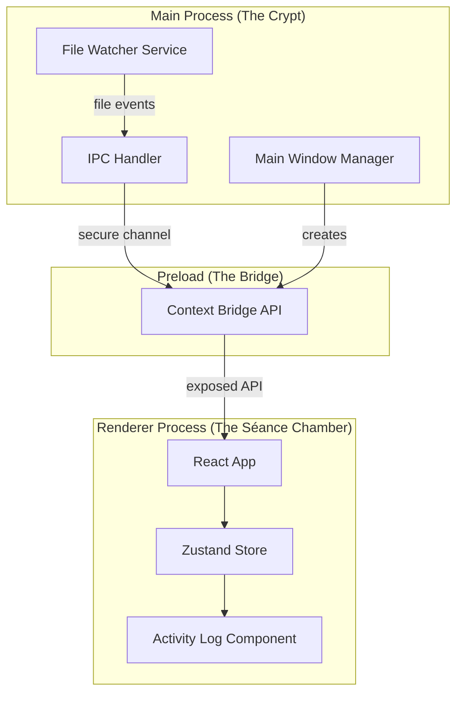

# Design Document

## Overview

The Necro-Pet Core Skeleton establishes a haunted foundation using Electron's multi-process architecture. The Main Process acts as the "crypt keeper" managing system-level operations (file watching, window creation), while the Renderer Process serves as the "séance chamber" where the React UI materializes. Communication between these realms occurs through a secure IPC bridge with whitelisted channels.

## Architecture



## Components and Interfaces

### Main Process Components

#### MainWindowManager
- **Location:** `src/main/window.ts`
- **Responsibility:** Creates and configures the frameless, transparent, always-on-top BrowserWindow
- **Interface:**
```typescript
export interface WindowConfig {
  width: number;
  height: number;
  transparent: boolean;
  frame: boolean;
  alwaysOnTop: boolean;
  skipTaskbar: boolean;
}

export const createMainWindow: () => BrowserWindow;
export const positionWindowBottomRight: (window: BrowserWindow) => void;
```

#### FileWatcherService
- **Location:** `src/main/fileWatcher.ts`
- **Responsibility:** Monitors filesystem using chokidar, emits events via IPC
- **Interface:**
```typescript
export interface FileEvent {
  type: 'file:changed' | 'file:added';
  path: string;
  timestamp: number;
}

export const initFileWatcher: (targetPath: string) => FSWatcher;
export const stopFileWatcher: () => void;
```

#### IPCHandler
- **Location:** `src/main/ipc.ts`
- **Responsibility:** Registers IPC handlers and sends events to renderer
- **Interface:**
```typescript
export const registerIPCHandlers: () => void;
export const sendFileEvent: (event: FileEvent) => void;
```

### Preload Script

#### ContextBridge API
- **Location:** `src/preload/index.ts`
- **Responsibility:** Exposes secure, whitelisted IPC channels to renderer
- **Interface:**
```typescript
// Exposed to renderer as window.electronAPI
export interface ElectronAPI {
  onFileChanged: (callback: (event: FileEvent) => void) => void;
  onFileAdded: (callback: (event: FileEvent) => void) => void;
  removeFileListeners: () => void;
}
```

### Renderer Process Components

#### ActivityLog
- **Location:** `src/renderer/features/activity-log/ActivityLog.tsx`
- **Responsibility:** Displays scrollable list of file events with auto-scroll
- **Interface:**
```typescript
export interface ActivityLogProps {
  maxEntries?: number; // default: 50
}

export const ActivityLog: React.FC<ActivityLogProps>;
```

#### ActivityLogStore (Zustand)
- **Location:** `src/renderer/features/activity-log/activityLogStore.ts`
- **Responsibility:** Manages file event state with entry limit enforcement
- **Interface:**
```typescript
export interface ActivityLogEntry {
  id: string;
  type: 'file:changed' | 'file:added';
  path: string;
  timestamp: number;
}

export interface ActivityLogState {
  entries: ActivityLogEntry[];
  addEntry: (event: FileEvent) => void;
  clearEntries: () => void;
}
```

## Data Models

### FileEvent
```typescript
interface FileEvent {
  type: 'file:changed' | 'file:added';
  path: string;
  timestamp: number;
}
```

### ActivityLogEntry
```typescript
interface ActivityLogEntry {
  id: string;           // UUID for React key
  type: 'file:changed' | 'file:added';
  path: string;         // Relative file path
  timestamp: number;    // Unix timestamp in ms
}
```

### WindowConfig
```typescript
interface WindowConfig {
  width: number;        // Default: 320
  height: number;       // Default: 400
  transparent: boolean; // true
  frame: boolean;       // false
  alwaysOnTop: boolean; // true
  skipTaskbar: boolean; // true
  x?: number;           // Calculated for bottom-right
  y?: number;           // Calculated for bottom-right
}
```


## Correctness Properties

*A property is a characteristic or behavior that should hold true across all valid executions of a system-essentially, a formal statement about what the system should do. Properties serve as the bridge between human-readable specifications and machine-verifiable correctness guarantees.*

### Property 1: IPC Channel Whitelist Enforcement
*For any* channel name string, if the channel is in the whitelist ('file:changed', 'file:added'), it SHALL be accessible via the context bridge; otherwise, it SHALL be inaccessible.
**Validates: Requirements 1.4**

### Property 2: File Changed Event Emission
*For any* file modification detected by chokidar in a non-ignored directory, the system SHALL emit a FileEvent with type 'file:changed' containing the correct file path.
**Validates: Requirements 2.2**

### Property 3: File Added Event Emission
*For any* file addition detected by chokidar in a non-ignored directory, the system SHALL emit a FileEvent with type 'file:added' containing the correct file path.
**Validates: Requirements 2.3**

### Property 4: Ignored Directory Filtering
*For any* file path containing 'node_modules', '.git', or 'dist' segments, the File_Watcher SHALL NOT emit any events for that path.
**Validates: Requirements 2.5**

### Property 5: Event Appending to Activity Log
*For any* valid FileEvent received by the Renderer_Process, the ActivityLogStore SHALL contain an entry with matching type, path, and timestamp after processing.
**Validates: Requirements 3.1**

### Property 6: Activity Log Entry Display Format
*For any* ActivityLogEntry, the rendered output SHALL contain the event type, the file path, and a formatted timestamp.
**Validates: Requirements 3.2**

### Property 7: Activity Log Size Invariant
*For any* sequence of FileEvents added to the ActivityLogStore, the entries array length SHALL never exceed 50, and when the limit is reached, the oldest entries SHALL be removed first (FIFO).
**Validates: Requirements 3.3**

### Property 8: Window Bottom-Right Positioning
*For any* screen dimensions (width, height) and window dimensions, the calculated window position SHALL place the window in the bottom-right corner with appropriate margin.
**Validates: Requirements 4.4**

## Error Handling

### Main Process Errors

| Error Type | Handling Strategy | User Feedback |
|------------|-------------------|---------------|
| File Watcher Init Failure | Log error, retry with fallback path | Display error in Activity Log |
| Chokidar Event Error | Catch, log, continue watching | Log "Watcher hiccup" message |
| IPC Send Failure | Log error, queue for retry | None (silent recovery) |
| Window Creation Failure | Log error, exit gracefully | System notification |

### Renderer Process Errors

| Error Type | Handling Strategy | User Feedback |
|------------|-------------------|---------------|
| IPC Listener Setup Failure | Log error, display fallback UI | Show "Connection lost" message |
| Store Update Failure | Catch in action, log error | Display error entry in log |
| Render Error | React Error Boundary | Show "Séance interrupted" message |

### Error Logging Format
```typescript
// All errors logged with spooky metaphors per steering rules
interface ErrorLog {
  timestamp: number;
  realm: 'crypt' | 'bridge' | 'seance'; // main, preload, renderer
  message: string; // e.g., "The spirits failed to watch: ENOENT"
  originalError?: Error;
}
```

## Testing Strategy

### Property-Based Testing Library
**Library:** fast-check (TypeScript property-based testing)

Property-based tests will be configured to run a minimum of 100 iterations per property.

### Unit Tests
- Window configuration validation
- IPC channel registration
- File path filtering logic
- Activity log entry formatting
- Zustand store actions

### Property-Based Tests
Each correctness property will be implemented as a property-based test using fast-check:

1. **IPC Whitelist Property Test:** Generate arbitrary channel names, verify only whitelisted channels are exposed
2. **File Event Emission Tests:** Generate file paths and event types, verify correct event structure
3. **Directory Filtering Test:** Generate paths with/without ignored segments, verify filtering
4. **Activity Log Tests:** Generate sequences of events, verify appending and size invariant
5. **Display Format Test:** Generate entries, verify rendered output contains required fields
6. **Window Position Test:** Generate screen/window dimensions, verify bottom-right calculation

### Test File Structure
```
src/
├── main/
│   └── __tests__/
│       ├── fileWatcher.test.ts
│       ├── fileWatcher.property.test.ts
│       └── window.test.ts
├── preload/
│   └── __tests__/
│       └── contextBridge.property.test.ts
└── renderer/
    └── features/
        └── activity-log/
            └── __tests__/
                ├── activityLogStore.test.ts
                ├── activityLogStore.property.test.ts
                └── ActivityLog.test.tsx
```

### Test Annotations
All property-based tests MUST include the following comment format:
```typescript
// **Feature: necro-pet-core-skeleton, Property {number}: {property_text}**
```
