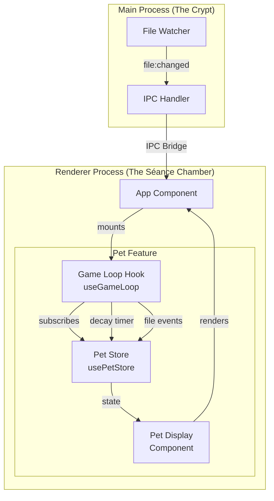

# Design Document

## Overview

The Pet State & Evolution feature transforms the Necro-Pet from a passive observer into a living creature that responds to developer activity. The architecture centers on a Zustand store (`usePetStore`) that manages the pet's vital statistics, with derived state calculations for evolution stage and mood. A `useGameLoop` hook orchestrates the decay mechanic (time-based health drain) and growth mechanic (event-driven health/XP gains). The `PetDisplay` component renders the pet's current state using pixel-art styled visuals that change based on stage and mood.

## Architecture



## Components and Interfaces

### Pet Store (Zustand)

- **Location:** `src/renderer/features/pet/petStore.ts`
- **Responsibility:** Manages pet state with derived calculations for stage and mood

```typescript
// Enums for type safety
export const Stage = {
  EGG: 'EGG',
  LARVA: 'LARVA', 
  BEAST: 'BEAST',
  GHOST: 'GHOST'
} as const;
export type Stage = typeof Stage[keyof typeof Stage];

export const Mood = {
  HAPPY: 'HAPPY',
  HUNGRY: 'HUNGRY',
  DEAD: 'DEAD'
} as const;
export type Mood = typeof Mood[keyof typeof Mood];

export interface PetState {
  health: number;      // 0-100
  xp: number;          // 0-infinity
  stage: Stage;
  mood: Mood;
}

export interface PetActions {
  decreaseHealth: (amount: number) => void;
  increaseHealth: (amount: number) => void;
  increaseXP: (amount: number) => void;
  reset: () => void;
}

export const usePetStore: UseBoundStore<StoreApi<PetState & PetActions>>;

// Pure functions for testing
export const calculateStage: (xp: number, health: number) => Stage;
export const calculateMood: (health: number) => Mood;
export const clampHealth: (value: number) => number;
```

### Game Loop Hook

- **Location:** `src/renderer/features/pet/useGameLoop.ts`
- **Responsibility:** Manages decay timer and IPC event listeners

```typescript
export interface GameLoopConfig {
  decayIntervalMs?: number;  // Default: 60000 (60 seconds)
  decayAmount?: number;      // Default: 1
  healthGain?: number;       // Default: 5
  xpGain?: number;           // Default: 1
}

export const useGameLoop: (config?: GameLoopConfig) => void;
```

### Pet Display Component

- **Location:** `src/renderer/features/pet/PetDisplay.tsx`
- **Responsibility:** Renders pet visual based on current state

```typescript
export interface PetDisplayProps {
  // No props - reads from store directly
}

export const PetDisplay: React.FC<PetDisplayProps>;
```

## Data Models

### PetState
```typescript
interface PetState {
  health: number;   // Clamped 0-100, starts at 100
  xp: number;       // Non-negative, starts at 0
  stage: Stage;     // Derived from XP (or GHOST if dead)
  mood: Mood;       // Derived from health
}
```

### Stage Thresholds
```typescript
const STAGE_THRESHOLDS = {
  EGG: { min: 0, max: 10 },
  LARVA: { min: 11, max: 50 },
  BEAST: { min: 51, max: Infinity }
} as const;
```

### Constants
```typescript
const PET_CONSTANTS = {
  MAX_HEALTH: 100,
  MIN_HEALTH: 0,
  INITIAL_HEALTH: 100,
  INITIAL_XP: 0,
  DECAY_INTERVAL_MS: 60000,
  DECAY_AMOUNT: 1,
  HEALTH_GAIN_PER_FILE: 5,
  XP_GAIN_PER_FILE: 1,
  HUNGRY_THRESHOLD: 50
} as const;
```

## Correctness Properties

*A property is a characteristic or behavior that should hold true across all valid executions of a system-essentially, a formal statement about what the system should do. Properties serve as the bridge between human-readable specifications and machine-verifiable correctness guarantees.*

### Property 1: Health Bounds Invariant
*For any* health modification (increase or decrease by any amount), the resulting health value SHALL always be within the range [0, 100] inclusive.
**Validates: Requirements 1.2, 3.3**

### Property 2: XP Non-Negativity Invariant
*For any* XP modification, the resulting XP value SHALL always be greater than or equal to 0.
**Validates: Requirements 1.3**

### Property 3: Stage Derivation from XP
*For any* XP value and health > 0, the stage SHALL be:
- EGG when XP is in [0, 10]
- LARVA when XP is in [11, 50]
- BEAST when XP > 50
**Validates: Requirements 4.1, 4.2, 4.3**

### Property 4: Death Overrides Stage
*For any* XP value, when health equals 0, the stage SHALL be GHOST and mood SHALL be DEAD.
**Validates: Requirements 4.4, 4.5**

### Property 5: Mood Derivation from Health
*For any* health value > 0, the mood SHALL be:
- HAPPY when health > 50
- HUNGRY when health is in [1, 50]
**Validates: Requirements 6.1, 6.2, 6.3**

### Property 6: Growth Mechanic Consistency
*For any* file change event received, health SHALL increase by exactly 5 (capped at 100) and XP SHALL increase by exactly 1.
**Validates: Requirements 3.1, 3.2**

### Property 7: Decay Mechanic Consistency
*For any* number of decay intervals N elapsed, health SHALL decrease by exactly N (floored at 0).
**Validates: Requirements 2.1**

### Property 8: Display State Reflection
*For any* pet state (health, xp, stage, mood), the PetDisplay rendered output SHALL contain the health value, XP value, and stage-appropriate visual elements.
**Validates: Requirements 5.1, 5.2, 5.3, 6.4**

## Error Handling

| Error Type | Handling Strategy | User Feedback |
|------------|-------------------|---------------|
| Invalid health value | Clamp to [0, 100] | None (silent correction) |
| Invalid XP value | Floor to 0 | None (silent correction) |
| IPC listener failure | Log error, retry connection | Display "Lost connection to the crypt" |
| Timer setup failure | Log error, disable decay | Display "Time stands still..." |
| Store initialization failure | Reset to defaults | Display "Resurrection failed, trying again..." |

### Error Logging Format
```typescript
// Spooky error messages per steering rules
const ERROR_MESSAGES = {
  IPC_FAILURE: "The spirits have lost their way...",
  TIMER_FAILURE: "The sands of time have frozen...",
  STORE_FAILURE: "The resurrection ritual has failed..."
} as const;
```

## Testing Strategy

### Property-Based Testing Library
**Library:** fast-check (TypeScript property-based testing)

Property-based tests will be configured to run a minimum of 100 iterations per property.

### Unit Tests
- Store initialization with correct defaults
- Timer cleanup on unmount
- IPC listener cleanup on unmount

### Property-Based Tests
Each correctness property will be implemented as a property-based test using fast-check:

1. **Health Bounds Test:** Generate arbitrary integers, apply to health, verify [0, 100] bounds
2. **XP Non-Negativity Test:** Generate arbitrary integers, apply to XP, verify >= 0
3. **Stage Derivation Test:** Generate XP values and health > 0, verify correct stage
4. **Death Override Test:** Generate XP values with health = 0, verify GHOST stage and DEAD mood
5. **Mood Derivation Test:** Generate health values > 0, verify correct mood
6. **Growth Mechanic Test:** Generate initial states, apply file event, verify +5 health (capped) and +1 XP
7. **Decay Mechanic Test:** Generate initial health and interval count, verify health - N (floored)
8. **Display Reflection Test:** Generate pet states, render component, verify output contains values

### Test File Structure
```
src/renderer/features/pet/
├── petStore.ts
├── useGameLoop.ts
├── PetDisplay.tsx
└── __tests__/
    ├── petStore.property.test.ts
    ├── useGameLoop.property.test.ts
    └── PetDisplay.property.test.tsx
```

### Test Annotations
All property-based tests MUST include the following comment format:
```typescript
// **Feature: pet-state-evolution, Property {number}: {property_text}**
```
