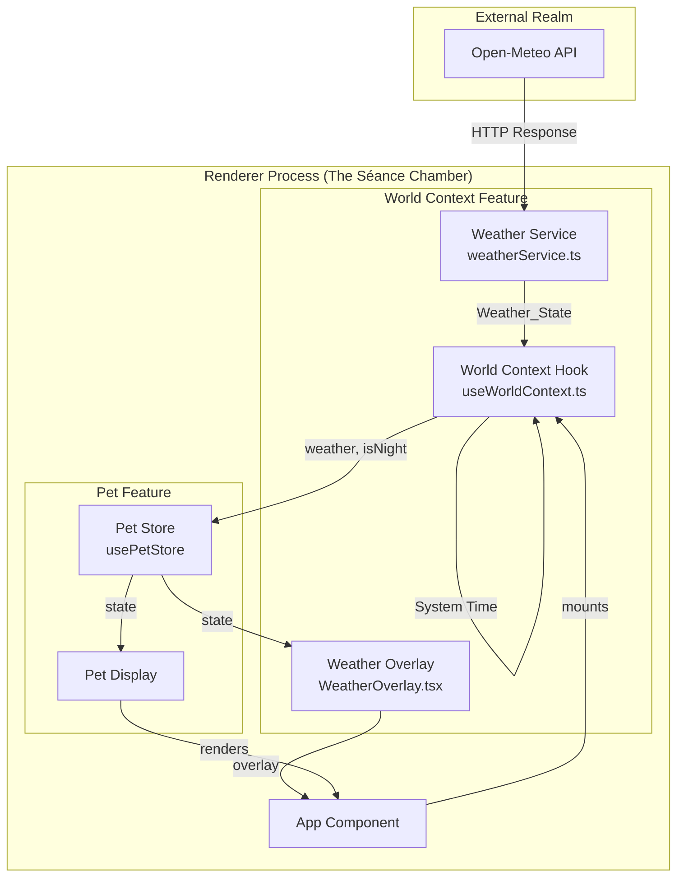

# Design Document

## Overview

The World Context feature extends the Necro-Pet's realm with environmental awareness, allowing the pet to exist within a dynamic world that reflects real-world conditions. The architecture introduces a Weather Service that communes with the Open-Meteo API to divine current weather conditions, a time context system that determines day/night cycles, and visual overlays that transform the pet's environment. The existing Pet Store is extended to hold world state, while a dedicated hook orchestrates the initial summoning of environmental data.

## Architecture



## Components and Interfaces

### Weather Service

- **Location:** `src/renderer/services/weatherService.ts`
- **Responsibility:** Fetches weather data from Open-Meteo API and maps WMO codes to simplified weather states

```typescript
// The four elemental states of the necromantic atmosphere
export const WeatherState = {
  CLEAR: 'CLEAR',
  RAIN: 'RAIN',
  SNOW: 'SNOW',
  STORM: 'STORM'
} as const;
export type WeatherState = typeof WeatherState[keyof typeof WeatherState];

export interface Coordinates {
  latitude: number;
  longitude: number;
}

export interface WeatherServiceResult {
  weather: WeatherState;
  wmoCode: number;
}

// Default coordinates - London, the fog-shrouded city
export const DEFAULT_COORDINATES: Coordinates = {
  latitude: 51.5074,
  longitude: -0.1278
};

// Pure function: Map WMO code to WeatherState
export const mapWMOCodeToWeather: (wmoCode: number) => WeatherState;

// Fetch current weather from the ethereal Open-Meteo API
export const fetchWeather: (coords?: Coordinates) => Promise<WeatherState>;
```

### Time Context Utility

- **Location:** `src/renderer/services/timeContext.ts`
- **Responsibility:** Determines day/night based on local system time

```typescript
// Pure function: Determine if the hour falls within the night realm
export const isNightTime: (hour: number) => boolean;

// Get current night status from system time
export const getCurrentTimeContext: () => boolean;
```

### World Context Hook

- **Location:** `src/renderer/hooks/useWorldContext.ts`
- **Responsibility:** Orchestrates weather fetch and time context on app mount, updates store

```typescript
// Hook that summons world context once upon mounting
export const useWorldContext: () => void;
```

### Extended Pet Store

- **Location:** `src/renderer/features/pet/petStore.ts` (extended)
- **Responsibility:** Manages pet state including world context

```typescript
// Extended state interface
export interface WorldContextState {
  weather: WeatherState;
  isNight: boolean;
}

export interface WorldContextActions {
  setWeather: (weather: WeatherState) => void;
  setIsNight: (isNight: boolean) => void;
}

// Full store type now includes world context
export type PetStoreState = PetState & WorldContextState;
export type PetStoreActions = PetActions & WorldContextActions;
```

### Weather Overlay Component

- **Location:** `src/renderer/features/weather/WeatherOverlay.tsx`
- **Responsibility:** Renders weather effects and night mode overlay

```typescript
export interface WeatherOverlayProps {
  // No props - reads from store directly
}

export const WeatherOverlay: React.FC<WeatherOverlayProps>;
```

## Data Models

### WeatherState
```typescript
type WeatherState = 'CLEAR' | 'RAIN' | 'SNOW' | 'STORM';
```

### WMO Code Mapping
```typescript
// WMO Weather interpretation codes (WMO 4677)
const WMO_MAPPING: Record<number, WeatherState> = {
  // Clear sky
  0: 'CLEAR',
  // Mainly clear, partly cloudy, overcast
  1: 'CLEAR', 2: 'CLEAR', 3: 'CLEAR',
  // Fog variants
  45: 'CLEAR', 48: 'CLEAR',
  // Drizzle variants
  51: 'RAIN', 53: 'RAIN', 55: 'RAIN',
  56: 'RAIN', 57: 'RAIN',
  // Rain variants
  61: 'RAIN', 63: 'RAIN', 65: 'RAIN',
  66: 'RAIN', 67: 'RAIN',
  // Snow variants
  71: 'SNOW', 73: 'SNOW', 75: 'SNOW',
  77: 'SNOW',
  // Rain showers
  80: 'RAIN', 81: 'RAIN', 82: 'RAIN',
  // Snow showers
  85: 'SNOW', 86: 'SNOW',
  // Thunderstorm variants
  95: 'STORM', 96: 'STORM', 99: 'STORM'
};
```

### Time Context Constants
```typescript
const TIME_CONSTANTS = {
  NIGHT_START_HOUR: 18,  // 6 PM
  NIGHT_END_HOUR: 6,     // 6 AM
} as const;
```

### Open-Meteo API Response Structure
```typescript
interface OpenMeteoResponse {
  current_weather: {
    weathercode: number;
    temperature: number;
    windspeed: number;
    // ... other fields we don't need
  };
}
```

## Correctness Properties

*A property is a characteristic or behavior that should hold true across all valid executions of a system-essentially, a formal statement about what the system should do. Properties serve as the bridge between human-readable specifications and machine-verifiable correctness guarantees.*

### Property 1: WMO Code Mapping Completeness
*For any* WMO weather code (integer 0-99), the mapping function SHALL return one of the four valid WeatherState values: 'CLEAR', 'RAIN', 'SNOW', or 'STORM'.
**Validates: Requirements 1.3**

### Property 2: Time Context Calculation
*For any* hour value (0-23), the isNightTime function SHALL return true if and only if the hour is less than 6 OR greater than or equal to 18.
**Validates: Requirements 2.2, 2.3**

### Property 3: Store Weather Update Consistency
*For any* valid WeatherState value, calling setWeather SHALL result in the store's weather property containing that exact value.
**Validates: Requirements 3.3**

### Property 4: Store Night Update Consistency
*For any* boolean value, calling setIsNight SHALL result in the store's isNight property containing that exact value.
**Validates: Requirements 3.4**

### Property 5: Weather Overlay Rendering Consistency
*For any* WeatherState value, the WeatherOverlay component SHALL render the appropriate visual elements: rain droplets for 'RAIN', snowflakes for 'SNOW', storm effects for 'STORM', and no effects for 'CLEAR'.
**Validates: Requirements 5.1, 5.2, 5.3, 5.4**

## Error Handling

| Error Type | Handling Strategy | User Feedback |
|------------|-------------------|---------------|
| API Fetch Failure | Return 'CLEAR' as default | Log "The weather spirits are silent..." |
| Invalid WMO Code | Map to 'CLEAR' | None (silent fallback) |
| Network Timeout | Return 'CLEAR' after 5s | Log "The ethereal connection timed out..." |
| Invalid Coordinates | Use London fallback | Log "Location unknown, defaulting to the fog..." |

### Error Logging Format
```typescript
// Spooky error messages per steering rules
const WEATHER_ERROR_MESSAGES = {
  FETCH_FAILURE: "The weather spirits refuse to speak...",
  TIMEOUT: "The ethereal connection has withered...",
  INVALID_RESPONSE: "The omens are unreadable...",
  LOCATION_UNKNOWN: "The compass spins wildly, defaulting to London's fog..."
} as const;
```

## Testing Strategy

### Property-Based Testing Library
**Library:** fast-check (TypeScript property-based testing)

Property-based tests will be configured to run a minimum of 100 iterations per property.

### Unit Tests
- Weather service API URL construction
- Default coordinate fallback behavior
- Store initialization with world context defaults
- Hook execution on mount (once only)
- Weather overlay CSS class application

### Property-Based Tests
Each correctness property will be implemented as a property-based test using fast-check:

1. **WMO Code Mapping Test:** Generate integers 0-99, verify each maps to a valid WeatherState
2. **Time Context Test:** Generate hours 0-23, verify isNight calculation matches specification
3. **Store Weather Update Test:** Generate WeatherState values, verify store updates correctly
4. **Store Night Update Test:** Generate booleans, verify store updates correctly
5. **Weather Overlay Test:** Generate WeatherState values, render component, verify correct elements

### Test File Structure
```
src/renderer/
├── services/
│   ├── weatherService.ts
│   ├── timeContext.ts
│   └── __tests__/
│       ├── weatherService.property.test.ts
│       └── timeContext.property.test.ts
├── hooks/
│   ├── useWorldContext.ts
│   └── __tests__/
│       └── useWorldContext.test.ts
└── features/
    ├── pet/
    │   ├── petStore.ts (extended)
    │   └── __tests__/
    │       └── petStore.property.test.ts (extended)
    └── weather/
        ├── WeatherOverlay.tsx
        └── __tests__/
            └── WeatherOverlay.property.test.tsx
```

### Test Annotations
All property-based tests MUST include the following comment format:
```typescript
// **Feature: world-context-weather-time, Property {number}: {property_text}**
```
