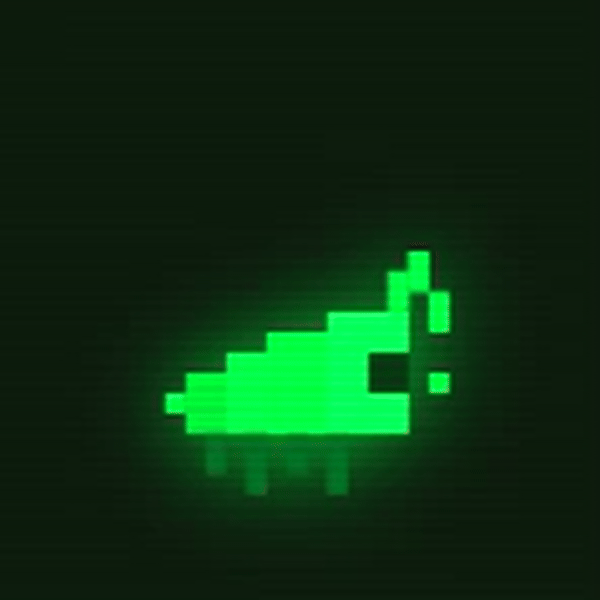
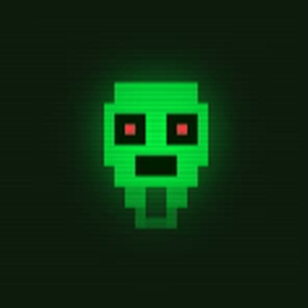
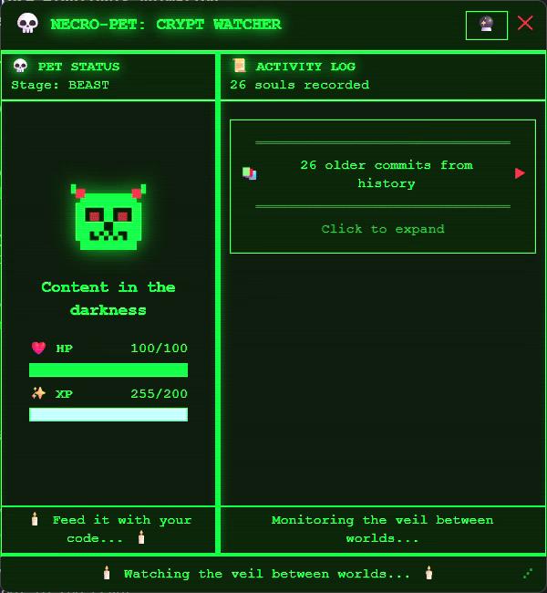
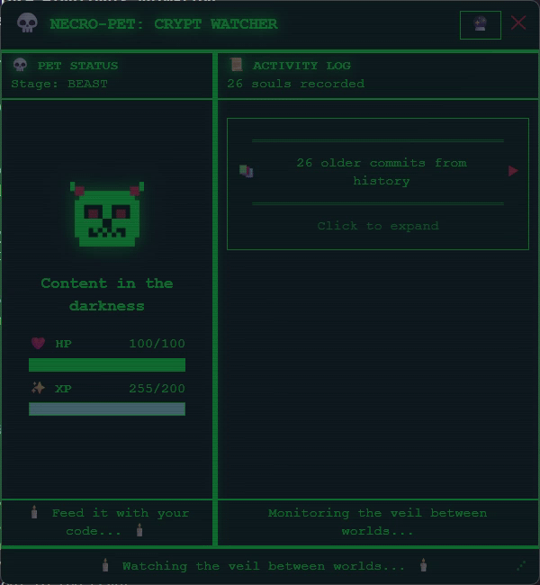
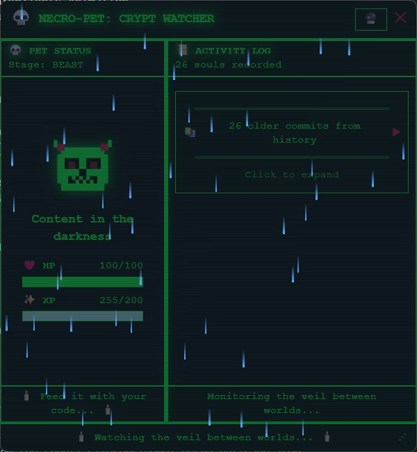
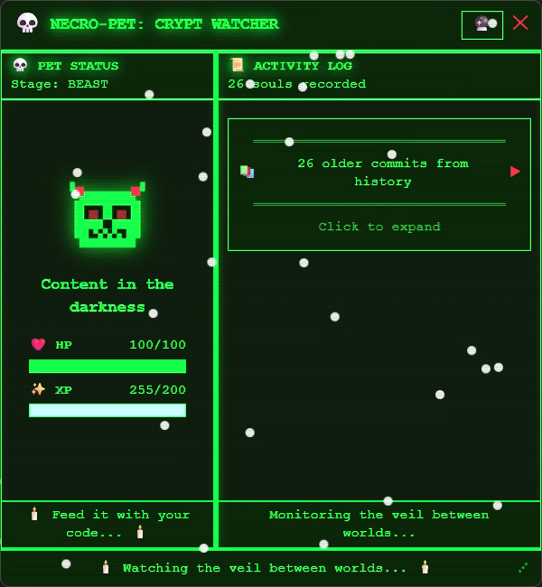
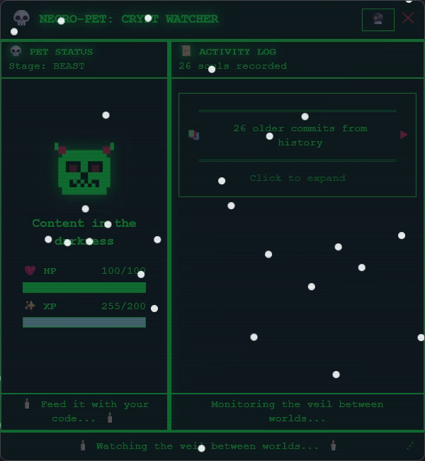
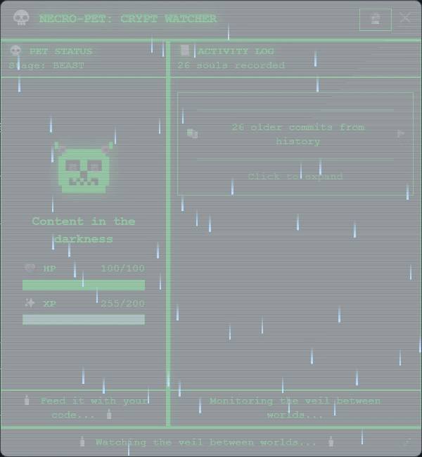

# 💀 NECRO-PET: The Undead Coding Companion

> *"Feed it with your code... or watch it perish."*

A haunted desktop virtual pet that feeds on your Git activity. Built for the **Kiroween Hackathon 2025** in the **Resurrection** category — bringing the beloved Tamagotchi back from the dead with modern tech.


---

## 🎥 Demo

### Quick Preview


*30-second GIF showing pet evolution and weather integration*

### Full Demonstration

🎬 **[Watch Full Demo on YouTube](YOUR_YOUTUBE_URL_HERE)** | 🎥 **[Watch Full Demo on Loom](YOUR_LOOM_URL_HERE)**

*Complete 3-minute video showcasing all features*

---

## 🦇 Overview

Necro-Pet is a **desktop virtual pet** that gamifies your coding workflow:

- **Save files** → Feed the beast with life essence
- **Stop coding** → Watch your pet's health decay
- **Neglect it too long** → It dies and becomes a ghost 👻

The pet evolves through stages: **Egg → Larva → Beast → Ghost (death)**

### 🎮 Pet Evolution Stages

| Stage | Visual | Description |
|-------|--------|-------------|
| **Egg** |  | The beginning of life - your pet awaits your first commit |
| **Larva** |  | Growing stronger with each file save |
| **Beast** |  | Fully grown and thriving on your code |
| **Ghost** |  | The final form when neglected too long |

### Features

- 🎮 **8-bit pixel art** aesthetic with scanline effects
- 🌦️ **Real-time weather integration** via Open-Meteo MCP
- 📜 **Activity log** showing file changes as "spirit disturbances"
- ⚡ **File watcher** that detects saves in your project
- 🎨 **Windows 95 Haunted House** visual theme

---

## 🕯️ Tech Stack

| Layer | Technology |
|-------|------------|
| Desktop | Electron 39 |
| UI | React 19 + TypeScript |
| Styling | Tailwind CSS (pixel-art config) |
| State | Zustand |
| Build | Vite |
| Weather | MCP Server (Open-Meteo API) |

---

## 🚀 Quick Start

```bash
# Clone the crypt
git clone https://github.com/ManishModak/necro-pet.git
cd necro-pet

# Summon the dependencies
npm install

# Resurrect the pet
npm run dev
```

---

## 🧪 Running Tests

```bash
npm test
```

---

## 📁 Project Structure

```
necro-pet/
├── .kiro/                    # Kiro AI configuration
│   ├── hooks/                # Agent hooks (Crypt Keeper's Chronicle)
│   ├── settings/             # MCP server config
│   ├── specs/                # Feature specifications
│   └── steering/             # AI steering documents
├── mcp-servers/              # Custom MCP server for weather
├── src/
│   ├── main/                 # Electron main process
│   ├── preload/              # Context bridge
│   └── renderer/             # React UI
│       └── features/
│           ├── pet/          # Pet display & state
│           ├── weather/      # Weather overlay
│           └── activity-log/ # File change log
└── package.json
```

---

## 🎃 How Kiro Powers Necro-Pet

### Comprehensive Kiro Integration

Necro-Pet demonstrates **all five Kiro capabilities** working together:

#### 1. Spec-Driven Development 📜 *(The Foundation)*

**How we used it:**

- Created three comprehensive specs in `.kiro/specs/`
  - `necro-pet-core-skeleton`: Defined Electron+React architecture with file watching requirements
  - `pet-state-evolution`: Specified health/XP mechanics with mathematical formulas
  - `world-context-weather-time`: Detailed weather integration requirements

**Impact:**

- Separated "what" (requirements) from "how" (implementation)
- Generated robust TypeScript interfaces and Zustand stores directly from specs
- Ensured game mechanics were mathematically sound before coding

#### 2. Agent Hooks 🤖 *(The Automation)*

**How we used it:**

- **Crypt Keeper's Chronicle Hook** (`crypt-keeper-log.kiro.hook`)
  - Runs on schedule (every 6 hours) via Kiro agent
  - Executes `git log --since="6 hours ago"` to analyze recent commits
  - Generates medieval fantasy narratives in `CRYPT_LOG.md`

**Example Output:**

```
📜 *The necromancer hath summoned forth 17 new souls from the void!
   A mighty Electron skeleton now stands, its bones forged from TypeScript.
   The beast feasts upon the fresh code, growing stronger with each commit...*
```

#### 3. Steering Documents 🧭 *(The Aesthetic Control)*

**How we used it:**

- `.kiro/steering/vibe.md`: Enforced "Digital Necromancy" theme rules
  - All UI text must use medieval fantasy language
  - Color palette limited to 8-bit green/black/red
  - Error messages framed as "curses" or "spirit disturbances"
- `.kiro/steering/pet_logic.md`: Balanced game mechanics
  - Health decay formula: `health -= 0.1% per minute of inactivity`
  - Feed formula: `health += 5% per file save, max +20% per hour`

#### 4. MCP (Model Context Protocol) 🌐 *(The Real-World Connection)*

**How we used it:**

- Custom **Open-Meteo MCP Server** (`mcp-servers/open-meteo-server.py`)
  - Fetches real-time weather data via Open-Meteo API
  - Exposes weather conditions to Kiro context
  - Pet environment reacts to actual weather:
    - Rain → Pixel rain animation + "dripping" sound effects
    - Snow → White overlay + "cold" health modifier (-0.5%/hour)
    - Storm → Lightning flashes + "frightened" pet behavior

**Technical Implementation:**

```python
# MCP Server extracts weather data
def get_weather_context():
    data = open_meteo_api.fetch()
    return {
        "current_weather": data["current"]["weather_code"],
        "temperature": data["current"]["temperature_2m"],
        "is_day": data["current"]["is_day"]
    }
```

#### 5. Vibe Coding 🎨 *(The Aesthetic Generation)*

**How we used it:**

- Generated entire Tailwind CSS theme from vibe description:
  - Input: *"Haunted Windows 95 with 8-bit green CRT monitor glow"*
  - Output: Complete `tailwind.config.js` with pixel-art plugin
- Created pixel-art components via vibe prompts:
  - *"Generate React component: 32x32 pixel ghost with scanline effect"*
  - Result: `src/renderer/features/pet/GhostDisplay.tsx`

---

## 🌦️ Weather Integration Showcase

Necro-Pet reacts to real-world weather conditions:

| Weather Type | Day Visual | Night Visual |
|--------------|------------|--------------|
| **Clear** |  |  |
| **Rain** |  |  |
| **Snow** |  |  |
| **Storm** |  |  |

---

## 🏆 Hackathon Submission: Resurrection Category

### Why This Project Belongs in Resurrection

**Resurrecting Obsolete Technology:**

- **Original Tech**: Tamagotchi (1996) - simple LCD pets with manual buttons
- **Modern Reimagining**: AI-powered desktop pet with real-world data integration

**The Transformation:**

| Original (1996) | Necro-Pet (2025) |
|----------------|------------------|
| Manual button presses | Git commit detection |
| Random number generators | LLM-driven narratives |
| Static pixel art | Dynamic weather-reactive environments |
| Isolated gameplay | Real-world data integration |
| Single device | Cross-project persistence |

### Solving Modern Developer Problems

1. **Gamified Productivity**: Visual feedback encourages frequent commits
2. **Burnout Prevention**: Health decay warns against overwork
3. **Cross-Project Engagement**: Pet state persists across different coding projects
4. **Team Collaboration**: Shared pet creates team coding challenges

---

## 📄 License

MIT License - See [LICENSE](LICENSE)

---

*🦇 May your commits be plentiful and your pet never perish... 🦇*
*💀 Resurrected for Kiroween 2025 - The Undead Coding Companion 💀*
